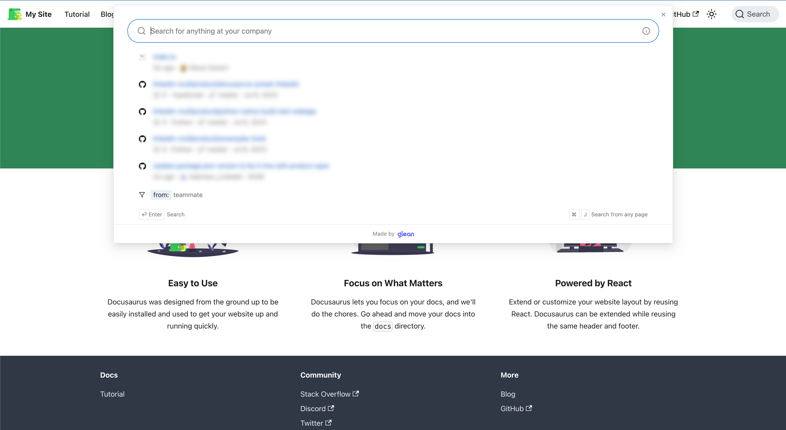
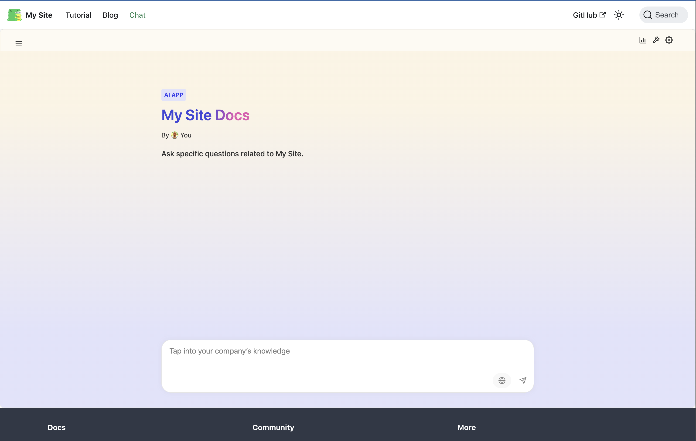

# docusarus-plugin-search-glean

A Docusarus plugin to integrate Glean search into your Docusaurus site.

## Description

This plugin utilizes Glean's JS SDK to enable both Glean search and AI App chat into your documentation. It is a drop-in replacement for the default Docusaurus search plugin.

## Features

### Glean Search

Enables you to integrate Glean's search into your Docusaurus site.



## Glean Chat (AI App)

Enables you to integrate Glean's AI App chat into your Docusaurus site (requires setting up an AI App in Glean).



## Installation

```bash
npm install docusaurus-plugin-search-glean
```

or

```bash
yarn add docusaurus-plugin-search-glean
```

## Usage

### Configuration in Glean

This plugin can be configured to use both Glean's search or chat features, or both.

1. **If your documentation doesn't change often**:

   Use statically configured `search` and `chat` configurations as options to the plugin. These options can be set in the `docusaurus.config.js` file. For `search`, you can set the `filters` option to filter the search results. For `chat`, you can set the `applicationId` option to identify the chat application.

   Any changes to the docusaurus site will be automatically picked up by Glean and the `search` content will be updated accordingly. For `chat`, changes to the site will **_not_** automatically update the knowledge sources for the Glean App - those changes must be made manually in Glean.

   Example:

   ```js
   module.exports = {
     // ...
     plugins: [
       [
         require.resolve('docusaurus-plugin-search-glean'),
         {
           searchOptions: {
             filters: [
               { key: 'app', value: 'github' },
               { key: 'type', value: 'page' },
               { key: 'repository', value: '<your repository name>' },
             ],
           },
           chatOptions: {
             applicationId: 'your-glean-app-id',
           },
         },
       ],
     ],
   };
   ```

   In this configuration, the `search` and `chat` features will be enabled, and the initial filters will be set to the values provided.

2. **If your documentation does change often**:

   Utilize Glean **collections** to dynamically configure the `search` and `chat` configurations. While this approach is more complex, it ensures that the `search` and `chat` configurations are always up-to-date with the current state of your documentation.

   In order to achieve this, you will need to create a Glean collection for your documentation. You can do this by:
   1. Creating a new Glean collection in the Glean UI.
   2. Creating an automated collections sync using GitHub Actions workflows and the [Glean Collections Sync](https://github.com/scalvert/glean-collections-sync) action. This action can be configured to sync a list of collection sync configs, the configuration used to produce these collections, to Glean. This will ensure that the collections are always up-to-date with the current state of your documentation.

   Example:

   `docusaurus.config.js`:

   ```js
   module.exports = {
     // ...
     plugins: [
       [
         require.resolve('docusaurus-plugin-search-glean'),
         {
           searchOptions: {
             filters: [{ key: 'collection', value: '<collection name>' }],
           },
           chatOptions: {
             applicationId: 'your-glean-app-id', // The App's Knowledge Sources should be configured to use the collection
           },
         },
       ],
     ],
   };
   ```

   `glean-collections-sync.yml`:

   ```yml
   name: Sync Collections

   on:
     schedule:
       - cron: '0 0 * * *' # Runs every day at midnight UTC
     workflow_dispatch: # Allows for manual triggering

   jobs:
     sync_collections:
       runs-on: ubuntu-latest

       steps:
         - name: Checkout repository
           uses: actions/checkout@v2

         - name: Sync collections
           uses: scalvert/glean-collections-sync@v1
           with:
             glean-client-api-url: ${{ secrets.GLEAN_CLIENT_API_URL }}
             glean-client-api-token: ${{ secrets.GLEAN_CLIENT_API_TOKEN }}
             glean-user-email: ${{ secrets.GLEAN_USER_EMAIL }}
             collection-sync-configs: '[{"name": "<collection name>", "query": "<collection query>", "filters": "<collection filters>"}]'
   ```

### Configuration in Docusaurus

Add this plugin to the `plugins` array in `docusaurus.config.js`.

```js
module.exports = {
  // ...
  plugins: [require.resolve('docusaurus-plugin-search-glean'), {}],

  // or, if you want to specify options:

  // ...
  plugins: [
    [
      require.resolve('docusaurus-plugin-search-glean'),
      {
        // Options
      },
    ],
  ],
};
```

### Making the Chat Page Accessible

When the chat feature is enabled, the plugin automatically creates a dedicated chat page (default path: `/chat`). However, **the plugin does not automatically add navigation links**. You need to manually add navigation elements to help users discover and access the chat functionality.

#### Option 1: Add a Navbar Link

Add a link to the chat page in your site's navigation bar by updating the `navbar.items` array in `docusaurus.config.js`:

```js
module.exports = {
  // ...
  themeConfig: {
    navbar: {
      items: [
        // ... your existing navbar items
        {
          label: 'Chat',
          to: '/chat', // Use the same path as your chatPagePath option
          position: 'right',
        },
      ],
    },
  },
};
```

#### Option 2: Add a Sidebar Link

If you prefer to add the chat link to a sidebar, you can include it in your sidebar configuration:

```js
// sidebars.js
module.exports = {
  tutorialSidebar: [
    // ... your existing sidebar items
    {
      type: 'link',
      label: 'Chat',
      href: '/chat', // Use the same path as your chatPagePath option
    },
  ],
};
```

#### Custom Chat Page Path

If you've configured a custom `chatPagePath` in your plugin options, make sure to use the same path in your navigation links:

```js
// Plugin configuration
[
  require.resolve('docusaurus-plugin-search-glean'),
  {
    chatPagePath: 'ai-assistant', // Custom path
    chatOptions: {
      applicationId: 'your-glean-app-id',
    },
  },
],

// Navbar link should match
{
  label: 'AI Assistant',
  to: '/ai-assistant', // Match your custom chatPagePath
  position: 'right',
}
```

### Options

| Property              | Type                                   | Description                                                               |
| --------------------- | -------------------------------------- | ------------------------------------------------------------------------- |
| `searchOptions`       | `Partial<ModalSearchOptions> \| false` | Options for search functionality. Pass `false` to disable.                |
| `chatOptions`         | `Partial<ChatOptions> \| false`        | Options for chat functionality. Pass `false` to disable.                  |
| `chatPagePath`        | `string`                               | Path to the chat page within the application.                             |
| `enableAnonymousAuth` | `boolean`                              | If true, the plugin will fetch guest authentication tokens automatically. |

For more information on the search and chat options, refer to the [Glean documentation](https://developers.glean.com/docs/browser_api/).
